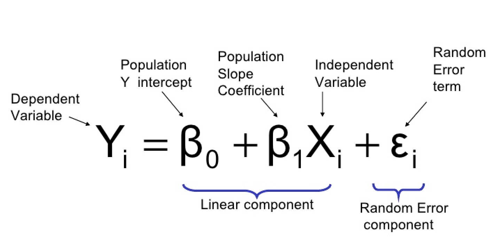
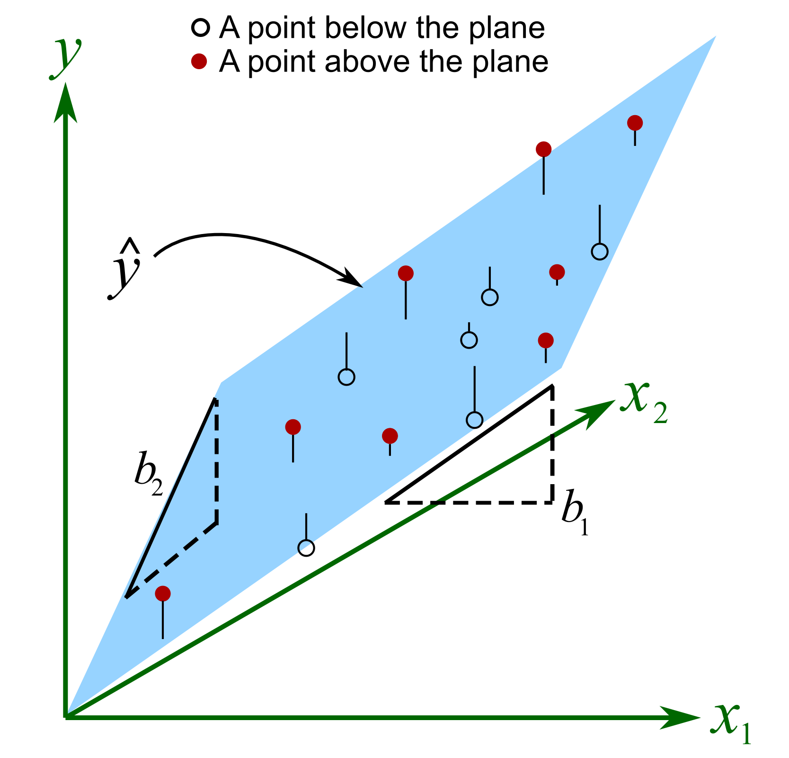
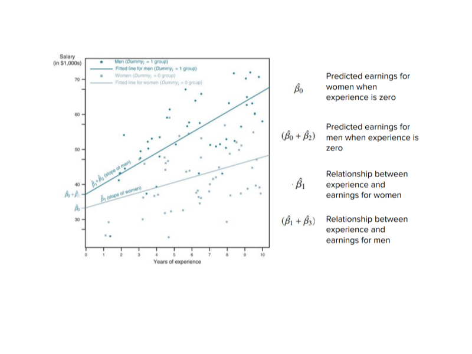

```{r setup, include=FALSE}
knitr::opts_chunk$set(echo = TRUE, warning = FALSE, message = FALSE)

## Packages
library(tidyverse)
library(qss)

```

# Introduction

```{r, echo=FALSE}

```

## Purpose of This Site

The goal of this site is to have a place where you can look for examples of code. Think of this site as a log of all of the topics we cover in class and in lab sessions. I will make updates throughout the semester as we cover more advanced material.

Let me know if any of this code doesn’t run correctly or if you have any questions or issues!

## Loading Data

The easiest way to load data into R and ensure you have the correct file path is to create a folder on your computer for each assignment and place the datasets directly into that folder.

1. Create a folder on your computer for each new analysis

2. Download your Data and move the file to your newly created folder

3. Then open RStudio

4. Click the project button in the top right corner

5. Click new project

6. Click existing directory

7. Click browse and find the folder that you created

8. Click create project

9. Once your new project opens, click the blank page with a green plus sign icon in the top left corner under the file option

10. Click R script to open a new script

11. You should also be able to see your data file in the bottom right window of RStudio, click the file and follow the options depending on the file type

12. Once your data is imported into R, the code that R automatically ran will be in the console window on the bottom left, copy and paste it to your fresh R script
  - For example, in Lab 1, my code looked like: `read_excel("Data/USstates.xlsx")`

13. Run this copy and pasted line of code whenever you open the R Project and you will never have to worry about complicated file pathing commands

14. I recommend using the assignment operator `<-` to give  your dataset a short and simple name like `df`, `dta`, or, if you are working with multiple datasets, name each something short and descriptive.

# Lab I: Introduction to R & R Studio

```{r, echo=FALSE}
knitr::include_graphics("image_1.png")
```

## Intro to R

```{r}
# Author: QSS Ch. 1 script with edits by Mark Richardson & Benjamin Reese
# Date: 08/24/2023
# Purpose: Introduction to R - GOVT 8001 Lab I

#### Arithmetic Operations ####

5 + 3
5 - 3
5 / 3
5 ^ 3
5 * (10 - 3)
sqrt(4)

#### Objects ####

result <- 5 + 3
result
print(result)
result <- 5 - 3
result
```


```{r, eval=FALSE}
## R is case sensitive so we get an error.
Result
```


```{r}
kosuke <- "instructor"
kosuke
kosuke <- "instructor and author"
kosuke

Result <- 5
Result + 2
result

class(result)
Result
class(Result)
class(sqrt)

sum(result)

sum(Result)

#### Vectors ####

# Creating vectors

world.pop <- c(2525779, 3026003, 3691173, 4449049, 5320817, 6127700, 6916183)
world.pop

pop.first <- c(2525779, 3026003, 3691173)
pop.second <- c(4449049, 5320817, 6127700, 6916183)
pop.all <- c(pop.first, pop.second)
pop.all

# Accessing elements of a vector

world.pop[2]
world.pop[c(2, 4)] 
world.pop[c(4, 2)] 
world.pop[-3]

# Arithmetic operations on a vector

pop.million <- world.pop / 1000
pop.million

pop.rate <- world.pop / world.pop[1]
pop.rate

pop.increase <- world.pop[-1] - world.pop[-7]
pop.increase

percent.increase <- (pop.increase / world.pop[-7]) * 100
percent.increase

# Can replace individual elements (better way is to use round())

round(percent.increase)

percent.increase[c(1, 2)] <- c(20, 22)
percent.increase

#### Functions ####

length(world.pop)  

min(world.pop)     

max(world.pop)     

range(world.pop)   

mean(world.pop)    

sum(world.pop) / length(world.pop) 

year <- seq(from = 1950, to = 2010, by = 10)
year

seq(to = 2010, by = 10, from = 1950)

seq(1950, 2010, 10)

seq(2010, 1950, -10)

seq(from = 2010, to = 1950, by = -10)
2008:2012
2012:2008

names(world.pop) 
names(world.pop) <- year
names(world.pop)

world.pop

#### Saving data and loading data ####
 
# Create a data set (Table 1.2)
# tibble() is the equivalent of data.frame() tidyverse function from the tibble package
UNpop <- data.frame(world.pop = world.pop,
                    year = year)

# Get basic information about the data set

names(UNpop)

nrow(UNpop)

ncol(UNpop)

dim(UNpop)

summary(UNpop)

UNpop$world.pop

UNpop[, "world.pop"] # extract the column called "world.pop"
UNpop[c(1, 2, 3, 5), ]   # extract the first three rows (and all columns)
UNpop[1:3, "year"]   # extract the first three rows of the "year" column

UNpop$world.pop[seq(from = 1, to = nrow(UNpop), by = 2)]

# File paths and working directory

getwd() # Confirm the change

#### Getting Help: mean() example ####

world.pop <- c(UNpop$world.pop, NA)
world.pop

mean(world.pop)

## Use Question Marks to see help documentation
?mean

mean(world.pop, na.rm = TRUE)
```

## Intro to `library(tidyverse)`

```{r}

# Packages

## install.packages("devtools") # install the package
library(devtools) # load the package

## install a package from github
## devtools::install_github("kosukeimai/qss-package", build_vignettes = TRUE)
library(qss) ## loading in qss
## You may need to allow R to update/install additional packages

## Loading in tidyverse
## install.packages("tidyverse")
library(tidyverse)

## Loading in a Dataset
data(UNpop, package = "qss")

## Number of Rows and Columns - Base R
dim(UNpop)

## Number of observation, number of variables, and initial observations - tidyverse
glimpse(UNpop)

## First 6 rows
head(UNpop)

## Last 6 Rows
tail(UNpop)

## Selecting A Variable - Base R
UNpop$world.pop

## subset all rows for the column called "world.pop" from the UNpop data
UNpop[, "world.pop"]
## subset the first three rows (and all columns)
UNpop[c(1, 2, 3),]
## subset the first three rows of the "year" column
UNpop[1:3, "year"]

## Now with tidyverse

## Subset the first three rows of UNpop with tidyverse
slice(UNpop, 1:3)

## Extract/subset the world.pop variable (column)
select(UNpop, world.pop)

## Base R subset the first three rows of the year variable
UNpop[1:3, "year"]
## or in tidyverse, combining slice() and select()
select(slice(UNpop, 1:3), year)

## Basic Data Wrangling with the tidyverse using pipes (i.e., %>%)

UNpop %>% # take the UNpop data we have loaded, and then...
  slice(1:3) %>% # subset the first three rows, and then...
  select(year) # subset the year column

UNpop %>%
  slice(seq(1, n(), by = 2)) %>% # using a sequence from 1 to n()
  select(world.pop)

pop.1970 <- UNpop %>% # take the UNpop data and then....
  filter(year == 1970) %>% # subset rows where the year variable is equal to 1970
  select(world.pop) %>% # subset just the world.pop column
  pull() # return a vector, not a tibble

## Print the vector to the console to see it
print(pop.1970)

UNpop.mill <- UNpop %>% # create a new tibble from UNpop
  mutate(world.pop.mill = world.pop / 1000) %>% # create a new variable, world.pop.mill
  select(-world.pop) # drop the original world.pop column

## Adding a variable with if_else
UNpop.mill <- UNpop.mill %>%
  mutate(after.1980 = if_else(year >= 1980, 1, 0))

## Creating a vector of the years of interest
specific.years <- c(1950, 1980, 2000)

## Adding a variable with if_else and %in%
UNpop.mill <- UNpop.mill %>%
  mutate(year.of.interest = if_else(year %in% specific.years, 1, 0))

summary(UNpop.mill)
mean(UNpop.mill$world.pop.mill)

## Add a row where values for all columns is NA
UNpop.mill.wNAs <- UNpop.mill %>%
  add_row(year = NA, world.pop.mill = NA,
          after.1980 = NA,
          year.of.interest = NA)
## Take the mean of world.pop.mill (returns NA)
mean(UNpop.mill.wNAs$world.pop.mill)
## Take the mean of world.pop.mill (ignores the NA)
mean(UNpop.mill.wNAs$world.pop.mill, na.rm = TRUE)

## Other Summary Statistics with tidyverse
UNpop.mill %>%
  summarize(mean.pop = mean(world.pop.mill),
            median.pop = median(world.pop.mill))

UNpop.mill %>%
  group_by(after.1980) %>% # create subset group for each value of after.1980
  summarize(mean.pop = mean(world.pop.mill)) # calculate mean for each group

```

# Lab II: Introduction to `library(tidyverse)` & R Markdown

```{r, echo=FALSE}
knitr::include_graphics("image_2_.png")
```


We can use R Markdown to create well-formatted PDFs or .html files that can easily display the results of our analyses. R Markdown, through Latex, also allows to write mathematical formulas with ease. Go ahead and knit - found in the top left corner - this file now and see what it looks like.

## In the setup chunk above, load the tidyverse packages as well as library(readr)

```{r, echo=TRUE, eval=FALSE}
## Example Setup Chunk

knitr::opts_chunk$set(echo = TRUE, message = FALSE, warning = FALSE)
## Packages
library(readr)
library(tidyverse)

```

## Load in the resume.RData file and use head(), tail(), glimpse(), dim(), summary(), and View() to examine each variable in the dataset. How many of the resumes have white sounding names? How many have African-American sounding names.

```{r}
## Loading Data
data(resume, package = "qss")

## Learning About the Dataset

head(resume)

tail(resume)

glimpse(resume)

dim(resume)

summary(resume)

View(resume) ## Comment this out when knitting.

## Number of observations by race
resume %>%
  group_by(race) %>%
  count()

```

## This experiment seeks to determine whether or not hiring managers discriminate on the basis of racial identity by sending idential resumes with African-American and white sounding names to job postings. The basic logic is that resumes are identical and only the name is changing, so any differences in call backs for jobs can be attributed to racial discrimination. Why do the authors want to randomize? And do you think this is an effective research design?

The concerns of examining race and the number of callbacks without randomization is that there could be confounders like workplace connections, amount of education, and employment history that could be correlated with race. It is possible that African-American applicants did not have the same employment and educational opportunities as white Americans, and, therefore, their resumes may look significantly different. This raises issues of counfounding and makes it impossible to differentiate if an employer made their decision based on race or based on the substance of the resume. The authors, though, randomized race, reducing this risk of confounding. Employers in this study are seeing nearly identical resumes, with only the race of the applicant being different, as indicated by a name. 

The field experiment presented here relies on racial connotations of different names, not explicit racial cues. Therefore, hiring managers are determining an applicant's race largely based on what scholars of identity politics would call "perceived race" or "street race" ([Lopez et al. 2017](https://www.ncbi.nlm.nih.gov/pmc/articles/PMC5800755/)), which is how others perceive an individual's race. This fact means that the selection of names is integral to the internal validity of the research design.

## We are going to see if there is a racial discrepency by taking the difference in callback rates between racial groups. Calculate the callback rate for white sounding name applicants and African-American sounding name applicants. Use Latex commands to write the formula for this calculation and display the result in text. Write the formula between $'s like $y = mx + b$ to use Latex commands.

```{r}
## Call Back for white Sounding Name Applicants
resume %>%
  group_by(race) %>%
  summarise(callback_rates = mean(call))

```

The callback rate for whites is .096. We take the mean of the binary callback variable, $\overline{x} = \frac{1}{n}\Sigma^{n}_{i=1}x_i$

The callback rate for African-American sounding name applicants is .064.

## Now, create a new object that stores the difference in callback rates named race_diff.

```{r}
## Calculating Callback Proportions
race_call <- resume %>%
  group_by(race, call) %>%
  count() %>%
  pivot_wider(names_from = call,
              values_from = n) %>%
  rename(no_call = `0`,
         call = `1`) %>%
  mutate(total_resumes = no_call + call,
         call_prop = call / total_resumes)

## Difference in call back rates
race_diff <- race_call %>% 
  select(race, call_prop) %>%
  pivot_wider(names_from = c(race),
              values_from = call_prop) %>%
  mutate(race_diff = white - black) %>%
  select(race_diff)

## Printing
race_diff

```

## Since Crenshaw (1989), manny scholars have concerned with intersectionality, or how race and gender interact to make the experiences of African-American women unique. We can use the data we have to explore the effect of race and gender specific sounding names on employment prospects. Calculate the call back rate by each race and gender category.

```{r}
## Callbacks by race and gender
resume %>%
  group_by(race, call, sex) %>%
  count() %>%
  pivot_wider(names_from = call,
              values_from = n) %>%
  rename(no_call = `0`,
         call = `1`) %>%
  mutate(total_resumes = no_call + call,
         call_prop = call / total_resumes)

```

## What is the difference in call back rates for each race/gender group?

```{r}
## Saving tibble from 8
dta <- resume %>%
  group_by(race, call, sex) %>%
  count() %>%
  pivot_wider(names_from = call,
              values_from = n) %>%
  rename(no_call = `0`,
         call = `1`) %>%
  mutate(total_resumes = no_call + call,
         call_prop = call / total_resumes)

## Calculating Differences
call_backs <- dta %>% 
  select(race, sex, call_prop) %>%
  pivot_wider(names_from = c(sex, race),
              values_from = call_prop) %>%
  mutate(white_sex_diff = female_white - male_white,
         black_sex_diff = female_black - male_black,
         male_race_diff = male_white - male_black,
         female_race_diff = female_white - female_black) %>%
  select(white_sex_diff, black_sex_diff, male_race_diff, female_race_diff)

## Printing
print(call_backs) ## print() is optional

```

# Lab III: Univariate Visualizations

```{r, echo=FALSE}
knitr::include_graphics("image_3.png")

```

```{r}

## Packages
library(tidyverse)
library(ggthemes)

## Data Loading
## Replace this with your working directory
load("~/GOVT8001/Lab 3/white_minwage.RData") 

```

This lab shows step-by-step how to build basic histograms and barplots with `library(ggplot2)`

## Histograms with `library(ggplot2)`

Histograms are good to visualize the distribution of one continuous variable.

### Step One
- Specify the tibble to be piped into `ggplot()`

```{r, eval = FALSE}
## Building A Basic Histogram 
df.county

```

### Step Two
- Pipe the tibble into ggplot()
- Specify the variable of interest with `ggplot(aes(x = X))`


```{r}
## Building A Basic Histogram 
df.county %>%
  ggplot(aes(x = minimum.wage))

```

### Step 3
- Use `+` instead of `%>%` to move to next line in `ggplot()`
- `geom_histogram()` creates the histogram

```{r}
## Building A Basic Histogram 
df.county %>%
  ggplot(aes(x = minimum.wage)) + 
  geom_histogram(aes(y = ..density..))

```

### Step 4
- Customization of theme, colors, and labels.
- You can also save the object above and customize it later as shown below
  - Use `col =` and `fill =` in `geom_histogram()` to set colors
  
```{r}
## Building A Basic Histogram 
df.county %>%
  ggplot(aes(x = minimum.wage)) + 
  geom_histogram(aes(y = ..density..), col = "dark red", fill = "tomato")

```

  - Use ` + theme()` to set the theme
    - `library(ggtheme)` has themes from your favorite publications!
  
```{r}
## Building A Basic Histogram 
df.county %>%
  ggplot(aes(x = minimum.wage)) + 
  geom_histogram(aes(y = ..density..), col = "dark red", fill = "tomato") + 
  theme_minimal()

```

  - Use `+ labs` to set labels
    - `title =` for a title
    - `subtitle =` for a subtitle
    - `x =` for x axis label and `y =` for y axis label
    - `caption =` for caption to include data source or note
  
```{r}
## Building A Basic Histogram 
df.county %>%
  ggplot(aes(x = minimum.wage)) + 
  geom_histogram(aes(y = ..density..), col = "dark red", fill = "tomato") + 
  theme_minimal() +
  labs(title = "Distribution of Minimum Wage", subtitle = "All US Counties 1996 - 2016",
       x = "Minimum Wage", caption = "Data Source: Markovich & White (2022)",
       y = "Density")

## Or You Can Save the Basic Plot and Experiment

p <- df.county %>%
  ggplot(aes(x = minimum.wage)) + 
  geom_histogram(aes(y = ..density..), col = "dark red", fill = "tomato")
p
p + 
  theme_minimal() +
  labs(title = "Distribution of Minimum Wage", subtitle = "All US Counties 1996 - 2016",
       x = "Minimum Wage", caption = "Data Source: Markovich & White (2022)",
       y = "Density")


```

## Barplots with `library(ggplot2)`

Barplots are good for visualizing distributions by groups. The steps here follow closely what we did for the histogram.

### Step One
- We will be using simulated data for this example.
- First we need to format our simulated data into something we can use for the barplot with the skills we learned last week.

```{r}
## Simulated Data
df <- data.frame("age" = c("18 to 29", "36 to 50", "51 to 64", "65+"),
                "popPct" = c(29, 21, 30, 20),
                "svyPct" = c(19, 21, 32, 28))
df
## Building A Basic Barplot
df %>% 
  rename(Population = popPct, Survey = svyPct) %>%
  pivot_longer(-age, names_to = "Group", values_to = "Percent")

```

### Step Two
- Pipe the tibble into ggplot()
- Specify the variable of interest with `ggplot(aes(x = X))`
- Since we want to show the distribution of X by some group, we can use `fill =` to specify the group 

```{r}
## Building A Basic Barplot
df %>% 
  rename(Population = popPct, Survey = svyPct) %>%
  pivot_longer(-age, names_to = "Group", values_to = "Percent") %>%
  ggplot(aes(x = age, y = Percent, fill = Group))

```

### Step 3
- Use `+` instead of `%>%` to move to next line in `ggplot()`
- `geom_bar()` creates a barplot

```{r}
## Building A Basic Barplot
df %>% 
  rename(Population = popPct, Survey = svyPct) %>%
  pivot_longer(-age, names_to = "Group", values_to = "Percent") %>%
  ggplot(aes(x = age, y = Percent, fill = Group)) +
  geom_bar(stat = "identity", position = "dodge")

```

### Step 4
- Now, we can customize just like above with the histogram.
- `scale_fill_grey()` changes the color palette to greyscale

```{r}
## Building A Basic Barplot 
df %>% 
  rename(Population = popPct, Survey = svyPct) %>%
  pivot_longer(-age, names_to = "Group", values_to = "Percent") %>%
  ggplot(aes(x = age, y = Percent, fill = Group)) +
  geom_bar(stat = "identity", position = "dodge") +
  scale_fill_grey() + 
  theme_minimal() +
  labs(x = "Age Group", y = "Percent",
       title = "Population and Survey Sample Proportions by Age Group")

```

## Now Make Your Own Histogram or Barplot!

```{r}
df.county %>%
  ggplot(aes(x = minimum.wage)) + 
  geom_histogram(aes(y = ..density..), col = "pink", fill = "black") +
  theme_economist() +
  labs(title = "Our Beautiful Plot")

```

# Lab IV: Loops, Lists, & Conditional Statements

```{r, echo=FALSE}
knitr::include_graphics("image_4.png")

```

```{r}
## Packages
library(tidyverse)
library(mosaic) ## for the Saratoga Houses Dataset

## Data
data("SaratogaHouses")

```

## Lists

### What is a list?
- A list is what is called a recursive vector
  - A recursive vector is a vector than can contain other vectors or lists
- Think of lists intuitively as a more flexible vector that can contain individual vectors and even dataframes/tibbles

```{r}
## Creating A List
presidents <- c("Washington", "Adams", "Jefferson", "Madison", "Monroe")

chief_justices <- c("Marshall", "Warren", "Burger", "Rehnquist", "Roberts")

ages <- c(51, 82, 12, 18, 43)

df <- data.frame(presidents, chief_justices)

list_1 <- list(presidents, chief_justices, ages, SaratogaHouses)

## Accessing specific objects in the list
list_1[[3]]

list_1[[1]]

```

## Indexing, Conditional Statements, & `if_else()`
- We can pull specific values of a variable out with []
  - This works with vectors and dataframes/tibbles

```{r}
## Pulling 4th observation of ages
ages[4]

## Pulling 1st observation of presidents
presidents[1]

## Pulling 2-4th observation of presidents
presidents[2:4]

## Pulling all except the 3rd-5th observation of ages
ages[-3]

## Example with a dataframe/tibble
SaratogaHouses[2,4]


SaratogaHouses[1:3, 4:7]

```

- You can also use indexing to pull out specific observations of a variable

```{r}
## Finding the prices for all houses with 3 bathrooms
SaratogaHouses$price[SaratogaHouses$bathrooms == 3]

## With dplyr
SaratogaHouses %>%
  filter(bathrooms == 3) %>%
  pull(price)

```

- These conditional statements can get more complicated as well

```{r}
## Finding the average price of a house with 5 bedrooms, 2 bathrooms, and a fireplace

mean(SaratogaHouses$price[SaratogaHouses$bedrooms == 5 & 
                            SaratogaHouses$bathrooms == 3 & 
                            SaratogaHouses$fireplaces > 0])

## With dplyr
SaratogaHouses %>%
  filter(bedrooms == 5, bathrooms == 3, fireplaces > 0) %>%
  summarise(avg_price = mean(price))

## Finding the cheapest house with 3 bedrooms on the water
min(SaratogaHouses$price[SaratogaHouses$bedrooms == 3 &
                           SaratogaHouses$waterfront == "Yes"])

## With dply
SaratogaHouses %>%
  filter(bedrooms == 3, waterfront == "Yes") %>%
  summarise(cheapest_house = min(price))

```

- You can also use `if_else()` to create new variables in `mutate()`

```{r}
## Showing if_else()
SaratogaHouses %>%
  mutate(fireplace = if_else(fireplaces > 0, 1, 0)) %>%
  select(fireplace) %>%
  slice(1:5)

SaratogaHouses %>%
  mutate(large_house = if_else(rooms > mean(rooms), 1, 0)) %>%
  select(large_house) %>%
  slice(1:5)

```

## Loops

### What is a Loop?
- A central concept of programming that is found in most programming languages
- Loops are control statements that execute one or more statements for a desired number of times
- Loops can be used to iterate applying a function a certain number of times to a specified object(s)

### How Loops Work in R

```{r}
## Basic Loop
for (i in 1:5) {
  
  print(i)
  
}

```

- Without `print()`
  - What happened?

```{r}
## Basic Loop
for (i in 1:5) {
  
  i
  
}

```

- Works for character and numeric vectors too

```{r}
## Character Vector
parties <- c("Democratic", "Republican", "Libertarian", "Green")

for (i in parties) {
  
  print(i)
  
}

## Numeric Vector
numbers <- c(1, 2, 3, 4, 5)
for (i in numbers) {
  
  print(i)
  
}

```

- Let's write a loop that applies the square root function to a vector of integers


```{r}
## Square Root Loop
for (i in 1:length(numbers)) {
  
  print(sqrt(i))
  
}

```

### Conditional Statements & Stopping Loops

```{r}
## A Loop That Stops
for (i in parties) {
  
  if (i == "Libertarian") {
    
    break
  }
  
  print(i)
}

```

### Conditional Statements & Skipping Iterations

```{r}
## A Loop That Skips An Iteration
for (i in parties) {
  
  if (i == "Republican") {
    
    next
  }
  
  print(i)
  
}

```

### if else Statements

```{r}
## Using if else
for (i in numbers) {
  
  if (i > 3) {
    
    print("Number Greater Than 3")
    
  }
  
  else {
    
    print("Number Less Than 4")
    
  }
  
  print(i)
  
}

```

### More Complicated Loops
- What is going on here?
  - page 146 in Imai & Williams (2022)

```{r}
## Example from QSS
values <- c(2, 4, 6)

n <- length(values)

results <- rep(NA, n)

for (i in seq_along(values)) {
  
  results[i] <- values[i] * 2
  print(str_c(values[i], " times 2 is equal to ", results[i]))
  
}

```

- What is going on here?

```{r}
## Loop to Calculate A Series of Means
for (i in 1:length(unique(SaratogaHouses$bedrooms))) {
  
  x <- mean(SaratogaHouses$price[SaratogaHouses$bedrooms == i])
  
  names(x) <- i
  
  print(x)
  
}

```

- Same thing with `library(tidyverse)`

```{r}
## Using dplyr()
SaratogaHouses %>%
    group_by(bedrooms) %>%
    summarise(avg_price = mean(price))

```

### Conditional Means
- A conditional mean is simply the mean of some variable given when a certain set of conditions are met. We do this in R by indexing and subsetting. As an example, assume that you may be interested in voter turnout by identity group. Thus, you are calculating the mean of voter turnout conditional on identity status. Remember this for regression to help intuitively understand what OLS is doing.

### Factor Variables
- A factor variable is a categorical variable that can only take a distinct set of values. An example is marital status which could take single, married, or divorced. A categorical variable like a people's names is not a factor variable as it could essentially take an infinite number of possible values.

## Lab Questions

### Use a loop and `library(dplyr)` to calculate the maximum price of a house conditional on the number of rooms that a house has.

```{r}
## Loop
for (i in 1:length(unique(SaratogaHouses$rooms))) {
  
  x <- mean(SaratogaHouses$price[SaratogaHouses$rooms == i], na.rm = T)
  
  names(x) <- i
  
  print(x)
  
}

## With dplyr
SaratogaHouses %>%
  group_by(rooms) %>%
  summarise(avg_price = mean(price))


```

### Create a loop that calculates the maximum and minimum house prices by number of bedrooms. Replicate with `library(dplyr)`

```{r}
## With Loop
for (i in 1:length(unique(SaratogaHouses$bedrooms))) {
  
  max_price <- max(SaratogaHouses$price[SaratogaHouses$bedrooms == i], na.rm = T)
  
  min_price <- min(SaratogaHouses$price[SaratogaHouses$bedrooms == i], na.rm = T)
  
  names(max_price) <- i
  
  names(min_price) <- i
  
  print(c(max_price, min_price))
  
}

## With dplyr
SaratogaHouses %>%
  group_by(bedrooms) %>%
  summarise(max_price = max(price),
            min_price = min(price))


```

### What is the most number of fireplaces in a house with five bedrooms?

```{r}
## Most Fireplace in 5 bedroom house
max(SaratogaHouses$fireplaces[SaratogaHouses$bedrooms == 5])

```

## Practice Creating Your Own Loops
- Use `SaratogaHouses` or use the `data()` command to bring in a dataset of your interest and write a loop to carry out an easy task.

# Lab V: Introduction to Regression

```{r, echo=FALSE}


```

```{r,results = 'hide', warning = FALSE, message = FALSE, echo = FALSE}
## Packages & Data
library(mosaic)
library(ggpubr)
library(tidyverse)
data("Galton")
force(Galton)
data("Mustangs")
force(Mustangs)
```

## Correlation
- Statistical technique that tells use the extent that two variables are linearly related
$$r=\frac{\sum_{i=1}^{n}(x_{i}-\bar{x})(y_{i}-\bar{y})}{\sqrt{\sum_{n}^{i=1}(x_{i}-\bar{x})^2\sum_{n}^{i=1}(y_{i}-\bar{y})^2}}$$
$$r = \frac{Cov(X,Y)}{SD(X)SD(Y)}$$
- Bounded between $-1,1$
- In *R*, `cor(x,y)`
- Scatterplot in *R*
  - `geom_point()`

### Correlation & Scatterplots
```{r, echo = FALSE, warning = FALSE, message = FALSE}
Galton %>%
  ggplot(aes(father, height)) +
  geom_point(col = "black", size = 3) +
  theme_bw() +
  xlab("Father's Height") +
  ylab("Child's Height") +
 ## geom_smooth(method = "lm", se=F, col="blue", lwd=2) +
  ggtitle("Correlation Between Father's and Child's Height")

Galton %>%
  ggplot(aes(father, height)) +
  geom_point(col = "black", size = 3) +
  theme_bw() +
  xlab("Father's Height") +
  ylab("Child's Height") +
 ## geom_smooth(method = "lm", se=F, col="blue", lwd=2) +
  ggtitle("Correlation Between Father's and Child's Height")+
  stat_cor(method = "pearson", aes(label = ..r.label..), size = 10, col = "red")

Mustangs %>%
  ggplot(aes(Miles, Price)) +
  geom_point(col = "black", size = 3) +
  theme_bw() +
  ggtitle("Used Car Price by Mileage") +
  stat_cor(method = "pearson", aes(label = ..r.label..), size = 10, col = "red")
```

## Introduction to Regression
- Why Regression?
- Basic Model
- Conditional Mean
- Estimation
- Coefficients & Intercepts

### Why Regression?
- Regression is the work-horse of quantitative social science
- We use regression when we want to know the relationship between $x$ and $y$
  - Specifically, we want to know what a one unit increase in $x$ means for $y$
- Real Data vs Hats
  - Hats are expected values
    - $y$ vs $\hat{y}$
- Identify a variable of interest, we call this $y$
  - Ex: vote share, approval rating, gdp, etc.
- Take its mean, $\bar{y}$
  - We have variation in our $y$ variable, though, e.g., some values are high and others are low
- Next find a variable that we think explains this variation, we call this $x$
- Then estimate the relationship between $x$ and $y$
- We call $x$ the treatment variable, causal variable, independent variable, predictor variable, explanatory variable
- We call $y$ the dependent variable, outcome variable, response variable

### Correlation vs Regression
- Similarities
  - Both show the direction and strength of the relationship between two variables
  - When correlation is negative, $r<0$, then the regression slope will be negative, $\beta_{1}<0$
  - When correlation is positive, the regression slope will be positive
- Differences
  - Regression is for causation (with additional steps) while correlation is for, well, correlation
  - $X$ and $Y$ are interchangeable in correlation, but results will change if you swap $X$ and $Y$ in regression
  - Correlation is a single statistic while regression gives us an equation

### Basic Model
$$\hat{y_{i}} = \hat{\beta_{0}} + \hat{\beta_{1}}x_{i}$$

analogous to 

$$y = mx + b$$

- Where:

  - $\hat{y_{i}} = y$, $\hat{\beta_{0}} = b$, $\hat{\beta_{1}}$ = m, and $x_{i}=x$
  - $\beta_{1}$ is the slope
  - $\beta_{0}$ is the y-intercept
  
Example of a model you may (will) see in the comparative politics literature:

$$GDPGrowth_{i} = \beta_{0} + \beta_{1}Democracy_{i} + \epsilon_{i}$$

- Why no hats?

### Conditional Mean
- Regression tells us the conditional mean of $y$ given $x$
  - $E[Y|X] = \beta_{0} + \beta_{1}X$


```{r, warning = FALSE, message = FALSE}
## Mean of All Children's Heights
mean(Galton$height)

## Mean of Female Children's Heights
mean(Galton$height[Galton$sex == "F"])

## Mean of Male Children's Heights
mean(Galton$height[Galton$sex == "M"])

## Conditional Mean with Regression
lm(height ~ sex, data = Galton)
```

### Estimation
$$\hat{\beta}=\frac{\sum_{i=1}^{n}(x_{i}-\bar{x})(y_{i}-\bar{y})}{\sum_{n}^{i=1}(x_{i}-\bar{x})^2}$$
$$\hat{\beta}= \frac{Cov(x,y)}{Var(x)}$$

- Intuitively, $\hat{\beta}$ is the variance of $x$ and $y$ together divided by the variance of $x$
  - Thus, you are left only with the variation in $y$ caused by $x$
- The main result of estimation is the **coefficient** and **intercept**
- In *R*, `lm(y ~ x)`

### Coefficients & Intercepts
- Coefficient
  - A one unit increase in $x$ is associated with a $\hat{\beta_{1}}$ increase in $y$
  - Be very careful about the units of $x$
    - For example, an $x$ that takes the values 0-1, a one unit increase is the full range of $x$
  
- Intercept
  - The fitted value of $y$ when $x=0$
  
  - We multiply any given value of x by the constant $\hat{\beta_{1}}$ and add the intercept to get $\hat{y}$, the fitted value of y

### Scatterplots & Regression Lines

```{r, echo = FALSE, warning = FALSE, message = FALSE}
Galton %>%
  ggplot(aes(father, height)) +
  geom_point(col = "black", size = 3) +
  theme_bw() +
  xlab("Father's Height") +
  ylab("Child's Height") +
  geom_smooth(method = "lm", se = F, lwd = 2) +
  ggtitle("Father's and Child's Height")+
  stat_regline_equation(size = 10, col = "red")
```
- How do we interpret $\hat{\beta}$ and $\hat{\alpha}$?
- What do you expect a child's height will be if their father's height is 70 inches?

```{r}
## Mean when father is 70 inches tall
mean(Galton$height[Galton$father == 70])
```

```{r, echo = FALSE, warning = FALSE, message = FALSE}
fit <- lm(Mustangs$Price ~ Mustangs$Miles)

Mustangs$predicted <- predict(fit)
Mustangs$residuals <- residuals(fit)


Mustangs %>%
  ggplot(aes(Miles, Price)) +
  geom_point(col = "black", size = 3) +
  theme_bw() +
  geom_smooth(method = "lm", se = F) +
  ggtitle("Used Car Price by Mileage") +
  stat_regline_equation(size = 10, col = "red")
```

- How would we find the residuals?

```{r, echo = FALSE, warning = FALSE, message = FALSE}
Mustangs %>%
  ggplot(aes(Miles, Price)) +
  geom_point(col = "black", size = 3) +
  geom_point(aes(y = predicted), shape = 1, size = 3) +
  geom_segment(aes(xend = Miles, yend = predicted)) +
  theme_bw() +
  geom_smooth(method = "lm", se = F) +
  ggtitle("Used Car Price by Mileage")
```

- $\hat{\epsilon} = y_i - \hat{y_i}$

## Lab Questions

- Download the *Correlates of War* dataset from Canvas.
- We are going to learn how to make scatterplots, find correlations, and run simple regressions.
- Sarkees, Meredith Reid and Frank Wayman (2010). Resort to War: 1816 – 2007. Washington DC: CQ Press.

### Question I - Load in the Data.

```{r, warning = FALSE, message = FALSE}
## Loading in Data
library(readr)
cow <- read_csv("~/GOVT8001/Lab 5/Intra-StateWarData_v4.1.csv")

```

### Question II - Create a scatterplot to show the joint distribution of war deaths by each side. Experiment with subsetting the data to different values of war deaths and visualization styles. Also, be careful about missing data and unknown values. Add a regression line.


```{r, warning = FALSE, message = FALSE}
## Scatterplot
cow %>%
  filter(SideADeaths < 20000 & SideADeaths > 0,
         SideBDeaths < 20000 & SideBDeaths > 0,
         EndYear1 >= 0) %>%
  ggplot(aes(x = SideADeaths, y = SideBDeaths)) + 
  geom_point() +
  geom_abline(method = "lm", col = "dark blue") +
  theme_bw() +
  labs(title = "Joint Distribution of War Deaths")

```

### Question III - What is the correlation coefficient for the relationship you depicted in Question II. What is the regression coefficient? How do we interpret each? Only filter out the less than zero observations for this question.

```{r, warning = FALSE, message = FALSE}
## Filtering Data
cow_filtered <- cow %>%
  filter(SideADeaths > 0,
         SideBDeaths > 0)

## Correlation
cor(cow_filtered$SideADeaths, cow_filtered$SideBDeaths)

## Regression
cow %>%
  filter(SideADeaths > 0,
         SideBDeaths > 0) %>%
  lm(SideBDeaths ~ SideADeaths, data = .) %>%
  summary()

```

### Question IV - Use both regression - the `lm()` function and the `mean()` function to show the difference between total war deaths depending on if a war was internationalized or not. Create a total deaths variable for this question.

```{r, warning = FALSE, message = FALSE}
## Difference in Means Based on Internationalization with Regression
cow_filtered %>%
  mutate(total_deaths = SideADeaths + SideBDeaths) %>%
  lm(total_deaths ~ Intnl, data = .) %>%
  summary()

## With Mean
cow_filtered %>%
  mutate(total_deaths = SideADeaths + SideBDeaths) %>%
  group_by(Intnl) %>%
  summarize(avg_deaths = mean(total_deaths))

## Differences
## With Mean
cow_filtered %>%
  mutate(total_deaths = SideADeaths + SideBDeaths) %>%
  filter(Intnl == 1) %>%
  summarize(non_int_deaths = mean(total_deaths)) %>%
  pull(non_int_deaths) -
  
  cow_filtered %>%
  mutate(total_deaths = SideADeaths + SideBDeaths) %>%
  filter(Intnl == 0) %>%
  summarize(non_int_deaths = mean(total_deaths)) %>%
  pull(non_int_deaths)
```

### Question V - Write a loop to find the average total deaths based on the month the war started in. Do the same with dplyr.

```{r, warning = FALSE, message = FALSE}
## Wrangling Data
cow_filtered <- cow_filtered %>%
  filter(StartMonth1 > 0) %>%
  mutate(total_deaths = SideADeaths + SideBDeaths)

## Loop
for (i in unique(cow_filtered$StartMonth1)) {
  
 x <- mean(cow_filtered$total_deaths[cow_filtered$StartMonth1 == i])
 
 names(x) <- i
 
 print(x)
  
}

## With dplyr
cow_filtered %>%
  group_by(StartMonth1) %>%
  summarise(avg_death_by_month = mean(total_deaths))
  
```

# Lab VI: Goodness of Fit & Multiple Regression

```{r, echo=FALSE}

```

```{r}
## Packages
library(tidyverse)
library(tidymodels)
library(mosaic)

## Data
load("~/GOVT5001/Lab VI/sh.RData")
house <- SaratogaHouses

## Model
model1 <- lm(price~bedrooms, data=house)
```

## $R^2$
$$1-\frac{SSR}{TSS} = \frac{\sum\epsilon^2}{\sum(y_{i}-\bar{y})^2}=\frac{MSS}{TSS}=\frac{\sum(\hat{y_{i}}-\bar{y})^2}{\sum(y_{i}-\bar{y})^2}$$

- Coefficient of Determination
- Proportion of the Variance in $Y_{i}$ explained by $X_{i}$
- "Goodness of Fit"

```{r, echo=TRUE}
##1-SSR/TSS
1-sum((model1$residuals)^2)/
sum((house$price-mean(house$price))^2)

## MSS/TSS
sum((model1$fitted.values-mean(house$price))^2)/
  sum((house$price-mean(house$price))^2)

summary(model1)$r.squared
```

$$R^2=Cor(Y_i,\hat{Y_i})$$

- Squared Correlation Between Observed Y and Fitted Y

```{r, echo=TRUE}
mod_aug <- augment(model1)

(cor(mod_aug$.fitted, mod_aug$price)^2)
```

- $R^2$ as proportional reduction in error

```{r}
## Constant Only model
null_model <- lm(house$price~1)

## The intercept is just the mean of Y
summary(null_model)$coefficient

mean(house$price)

## R Squared is 0
summary(null_model)$r.squared

## Squared of Model 1
summary(model1)$r.squared

```

- The number of bedrooms that a house has explains 16% of the variation in the price of a house

## Mean Squared Error & Root Mean Squared Error
$$\hat{MSE} = \frac{1}{n}\sum^{n}_{i=1}(Y_{i}-\hat{Y_{i}})^2$$

- Average distance from the line-of-best-fit

- The root mean square error, or RMSE, is calculated by taking the square root of the MSE. Here is the formula:
$$\hat{RMSE} = \sqrt{\frac{1}{n}\sum^{n}_{i=1}(Y_{i}-\hat{Y_{i}})^2}$$

- The average prediction error in units of Y

```{r}
fit <- lm(Mustangs$Price ~ Mustangs$Miles)

Mustangs$predicted <- predict(fit)
Mustangs$residuals <- residuals(fit)

Mustangs %>%
  ggplot(aes(Miles, Price)) +
  geom_point(col = "black", size = 3) +
  geom_point(aes(y = predicted), shape = 1, size = 3) +
  geom_segment(aes(xend = Miles, yend = predicted)) +
  theme_bw() +
  geom_smooth(method = "lm", se = F) +
  labs(x = "X", y = "Y")

```

- Take the square root of the mean of the distance of the solid black lines for RMSE

```{r, echo=TRUE}
## MAE of Model 1
summary(model1)$sigma

## Manually
sqrt(mean((mod_aug$.fitted - mod_aug$price)^2))

```

## Multiple Regression

$$Price_{i}=\beta_{0} + \beta_{1}Bedrooms_{i} + \beta_{2}Bathrooms_{i} + \epsilon_{i}$$

```{r, echo=TRUE}
lm(price~bedrooms + bathrooms, data=house)
```

## Adjusted $R^2$

$$Adjusted\space R^2 = 1- \frac{(1-R^2)(N-1)}{(N-k-1)}$$

- $R^2$ is just $R^2$
- $N$ is the sample size
- $k$ is the number of independent variables
- Penalizes us for just throwing more variables at the model
- Proportion of variation in $Y_{i}$ explained by the model

```{r, echo=TRUE}
model2 <- lm(price~bedrooms + bathrooms, data=house)

1-(1-summary(model2)$r.squared)*(length(house$price)-1)/
((length(house$price)-2-1))

summary(model2)$adj.r.squared
```

## Lab Questions: Congratulations! You've been hired as an analyst by the [insert your favorite baseball team name here]. Your first job is to make a few predictions about what your teams' future will look like. 

- Download lab_vi.Rmd from Canvas
- Download bbData.RData from Canvas
- Try the lab questions!

### Load in the bbDta.RData file.

```{r}
load("~/GOVT5001/Lab VI/bbData.RData")

```

### Run a regression model with attendance as the DV and wins as the IV. Save as model1.

```{r}
## Simple Regression Model
model1 <- lm(home_attend ~ wins, data = bbData)
model1

```

### Does winning increase attendance? If so, by how much?

```{r}
## Pulling out coefficient
model1$coefficients[2]

```

### Create a scatterplot to illustrate your results from A and B.

```{r}
## Hint: Run the line of code below to remove scientific notation.
options(scipen = 999999)

## Creating Plot
ggplot(bbData, aes(x = wins, y = home_attend/1000000)) +
  geom_point() +
  geom_smooth(method = "lm", se = F) + 
  theme_bw() +
  labs(title = "Baseball Attendance by Wins", x = "Wins", 
       y = "Attendance At Home Games in Millions")

```

### Does a higher number of wins increase attendance when you include runs_scored and runs_allowed into your model? What is wins' new effect. Save the results as model2.

```{r}
## Multiple Regression Model
model2 <- lm(home_attend~wins + runs_scored + runs_allowed, data=bbData)
model2

```

Wins increase attendance by 3,261 while holding all other factors equal.

### Assess fit. What is the change in R^2 from model1 to model2?

```{r}
## Examining R Squared
summary(model2)$adj.r.squared
summary(model2)$adj.r.squared - summary(model1)$r.squared

```

Model 2 explains  29% of the variation in home_attendance. The change is about * percentage points.

### Which model do you think is best?

For our purposes, model 2 has the highest r squared, so model 2 is the best.

### Use your preferred model to predict attendance based on 100 wins, 500 runs scored, and 360 runs allowed.

```{r}
## Making Predictions
-270324 + (3261*100) + (4260*500) + (-1683*360)

## With Code
model2$coefficients[1] + (model2$coefficients[2]*100) + (model2$coefficients[3]*500) + 
  (model2$coefficients[4]*360)
```

### Based on your models, how can teams increase their attendance?

Answer: Teams should win more games, score more runs, and allow less runs scored against them. Easy!

### Your colleague argues that runs have been increasing over time. Create a scatterplot, with a line of best fit, to evaluate their claim.

```{r}
## Plot
ggplot(bbData, aes(x = season, y = runs_scored)) +
  geom_point() +
  geom_smooth(method = "lm", se = F) + 
  theme_bw() +
  labs(title = "Runs Scored Over Time", x = "Season Year", 
       y = "Runs Scored")

```

### The analysis above is for the full MLB. Rerun your models and scatterplots for one team.

```{r}
## Subset the data
phiData <- subset(bbData, team == "PHI")


## Models
model1b <- lm(home_attend~wins, data = phiData)
model1b
model1

model2b <- lm(home_attend~wins + runs_scored + runs_allowed, data = phiData)
model2b
model2

## Wins and Attendance
ggplot(bbData, aes(x = wins, y = home_attend/1000000)) +
  geom_point() +
  geom_smooth(method = "lm", se = F) + 
  theme_bw() +
  labs(title = "Baseball Attendance by Wins", x = "Wins", 
       y = "Attendance At Home Games in Millions", subtitle = "Philadelphia Phillies")

## Runs Scored by Season
ggplot(phiData, aes(x = season, y = runs_scored)) +
  geom_line() +
  theme_bw() +
  labs(title = "Runs Scored Over Time", x = "Season Year", 
       y = "Runs Scored", subtitle = "Philadelphia Phillies")

## Line Plot
ggplot(phiData, aes(x = season, y = runs_scored)) +
  geom_point() +
  geom_smooth(method = "lm", se = F) + 
  theme_bw() +
  labs(title = "Runs Scored Over Time", x = "Season Year", 
       y = "Runs Scored", subtitle = "Philadelphia Phillies")

```

# Lab VII: Interactions & Categorical Variables

```{r, echo=FALSE}

load("~/GOVT5001/Lab VII/Ch6_ChapterExample_Trump.RData")
```

## Categorical Variables and Reference Categories

### Loading Data
```{r, echo=TRUE}
load("~/GOVT5001/Lab VII/social.RData")
```

### The Four Categories of the Treatment Variable

```{r, echo=TRUE}
unique(social$messages)
```

### Estimating the Model

```{r, echo=TRUE}
reg1 <- lm(primary2006~messages, data=social)
```

### Difference in Means Between Categories

```{r, echo=TRUE}
reg1$coefficients[1]
reg1$coefficients[2]
reg1$coefficients[3]
reg1$coefficients[4]
```

### Changing the Reference Category

```{r, echo=TRUE}
social$messages <- as.factor(social$messages)

reg2 <- lm(primary2006~relevel(messages, "Control"), 
           data=social)

reg2$coefficients[1]
reg2$coefficients[2]
reg2$coefficients[3]
reg2$coefficients[4]
```

## Interactions
- How to use interactions
  - In *R*
    - `lm(y~x*z, data=data)` or `lm(y~x + z + x:z, data=data)`
- We write a model with an interaction term as:

$$\hat{Y_i}=\hat{\beta_0} + \hat{\beta_1}X_i + \hat{\beta_2}Z_i + \hat{\beta_3}(X_i*Z_i)$$

### Interpreting Interactions

$$\hat{Wage_i}=\hat{\beta_0} + \hat{\beta_1}Experience_i + \hat{\beta_2}Male_i + \hat{\beta_3}Experience_i*Male_i$$

- $\beta_0$ - Predicted wage for women with no experience

- $\beta_0 + \beta_1$ - Relationship between experience and earnings for women

- $\beta_0 + \beta_1 + \beta_2 + \beta_3$ - Predicted Wage for men with experience

- $\beta_1$ - The effect of experience for women

- $\beta_0 + \beta_2$ - Predicted earnings for men when experience is zero

- $\beta_1 + \beta_3$ - Relationship between experience and earnings for men

## Lab Questions

### What is the effect of age on support for Trump, conditional on being a Republican? Do this with both the colon, ":", and the "*".

```{r}
model1a <- lm(TrumpFT~Rep*Age, data=dta)
model1a

model1b <- lm(TrumpFT~Rep + Age + Rep:Age, data=dta)
model1b

```

### What is the effect of age on support for Trump, conditional on being a Democrat?

```{r}
model2a <- lm(TrumpFT~Dem*Age, data=dta)
model2a

model2b <- lm(TrumpFT~Dem + Age + Dem:Age, data=dta)
model2b

```

### Interpret the following plot.

```{r}
plot(dta$Age, dta$TrumpFT, color=dta$Rep, col=c("red", "blue"), 
     main="The Effect of Age on Support for Trump Conditional on Party ID",
     xlab = "Age", ylab = "Trump FT", las=1, xlim=c(0,100), pch="")
abline(lm(TrumpFT~Age, data = subset(dta, Rep==TRUE)), col="dark red", lwd=3)
abline(lm(TrumpFT~Age, data = subset(dta, Dem==TRUE)), col="dark blue", lwd=3)

```

### What are your predictions for how women may feel about Clinton, how Democrats may feel about Clinton, and how Democratic women may feel about Clinton? Then estimate the model.

Most answers will be good here. The idea is just to think about conditional effects. For example, women may approve more of Clinton because she could have been the first woman president. Democrats probably approve of Clinton because she was the Democratic nominee for president. Democratic women, then, may support Clinton EVEN more than Republican women and Democratic men. The conditional effect of being a Democrat for women will be positive.

```{r}
model3 <- lm(ClintonFT~Female*Dem, data=dta)
model3

```

### How do we interpret the following:

- Intercept = Clinton Feelings for Male Republicans

- Intercept + Beta 1 = Clinton Feelings for Female Republicans

- Intercept + Beta 2 = Clinton Feelings for Male Democrats

- Intercept + Beta 1 + Beta 2 + Beta 3 = Clinton Feelings for Female Democrats

- Beta 1 - The Effect of Sex for Republicans

- Beta 2 - The Effect of Party for Men

- Beta 2 + Beta 3 - The Effect of Party for Women

- Beta 1 + Beta 3 - The Effect of Sex for Democrats

### Estimate the the same model as above, but for Trump and Republicans.

```{r}
model4 <- lm(TrumpFT~Female*Rep, data=dta)
model4

```

### Calculate the following:

- What is Trump's average feeling for male Democrats? - 19.134

- What is Trump's average feeling for female Democrats? - 10.247

- What is Trump's average feeling for male Republicans? - 52.33

- What is Trump's average feeling for female Republicans? - 49.408

# Lab VIII: Publication Ready Tables & Interactions (cont.)

```{r, echo=FALSE}
knitr::include_graphics("image_8.png")

```

## Making Tables

```{r}
## Loading Packages
library(stargazer)

## Loading Data - Change this to your working directory
load("~/GOVT5001/Lab VI/bbData.RData")

## Running Models
model1 <- lm(home_attend ~ wins, data = bbData)
model2 <- lm(home_attend ~ wins + runs_scored + runs_allowed, data=bbData)

```

```{r, results='asis'}
stargazer(model1, model2, type = "html")

```

```{r, results='asis'}
stargazer(model1, model2, covariate.labels = c("Wins", "Runs Scored", "Runs Allowed"), 
          dep.var.labels = "Home Attendance", header = FALSE,
          title = "OLS Results", type = "html")

```

```{r, results='asis'}
stargazer(model1, model2, covariate.labels = c("Wins", "Runs Scored", "Runs Allowed"), 
          dep.var.labels = "Home Attendance", header = FALSE,
          title = "OLS Results", omit.stat = c("rsq", "adj.rsq"),
          column.labels = c("Model 1", "Model 2"), type = "html")

```

## Interactions Practice Problems

These lab questions will test both your programming and interpretation skills! It covers most of the programming and regression related topics we have covered up until now. We will be exploring the relationship between politics and monetary policy in the US.

### In your own words, what is an interaction term?

An interaction occurs when an independent variable has a different effect on the outcome depending on the values of another independent variable. We can think of this as a conditional effect.

### What is the Federal Reserve Funds Rate?

The interest rate that banks charge each other to borrow or lend excess reserves overnight. It is "set" by the Federal Open Markets Committee. A higher Fed Funds Rate means more expensive borrowing costs. Banks can then pass on higher borrowing costs by raising the rates they charge for consumer loans.

### What is the Federal Reserves' Dual Mandate?

The dual mandate is usually discussed as keeping unemployment and inflation at normative rates. About 1-2% for inflation and 4-5% for unemployment.

### Estimate a model with FEDFUNDS as the DV, Democrat and Quarters as the IVs, and include an interaction between Democrat and Quarters.

```{r}
## Loading Data
load("~/GOVT8001/Lab 8/fed.RData")

model1 <- lm(FEDFUNDS~Democrat + Quarters + Democrat:Quarters, data=dta)
model1

```

### You can also create an "intereacted" variable and include it in the model. Re-estimate the model above with a new variable called dem_quarters that is the interaction term between quarters and Democrat.

```{r}
dta$dem_quarters <- dta$Democrat*dta$Quarters

model2 <- lm(FEDFUNDS~ Democrat + Quarters + dem_quarters, data=dta)
model2

```

### What change in federal fund rates is associated with a one-unit increase in the quarters variable when the president is a Republican?

A one-unit increase in the election variable when the president is a Republican is associated with a fall in the Federal Funds rate of 0.26 percentage points.  It is simply the coefficient on the quarters variable.

### What change in federal fund rates is associated with a one-unit increase in the election variable when the president is a Democrat?

A one-unit increase in the election variable when the president is a Democrat is associated with an increase in the Federal Funds rate of -0.264 + 0.558 = 0.293 percentage points. The effect when a Democrat is president is the sum of the coefficients on the election variable and the interaction of the election variable and the dummy for Democratic presidents.

### Create a Republican variable and estimate the same model as above, but for Republicans.

```{r}
dta <- dta %>%
  mutate(Republican = if_else(dta$Democrat == 0, 1, 0))

model2b <- lm(FEDFUNDS~Republican*Quarters, data=dta)
model2b

```

### Create two scatterplots, for years in which a Democrat was president and one for years in  which a Republican was president, showing the relationship between inflation and the quarters since the previous election. Repeat this for the Fed Funds Rate.

```{r}
## Plot for Democrats
dta %>%
  filter(Democrat == 1) %>%
  ggplot(aes(x = Quarters, y = inflation)) +
  geom_point() +
  geom_smooth(method = "lm", se = F, col = "blue") +
  theme_bw() +
  labs(title = "Inflation When Democrat is in Office",
       x = "Quarters from Last Election",
       y = "Inflation")

## Plot for Republicans
dta %>%
  filter(Democrat == 0) %>%
  ggplot(aes(x = Quarters, y = inflation)) +
  geom_point() +
  geom_smooth(method = "lm", se = F, col = "red") +
  theme_bw() +
  labs(title = "Inflation When Republican is in Office",
       x = "Quarters from Last Election",
       y = "Inflation")

## Plot for Democrats
dta %>%
  filter(Democrat == 1) %>%
  ggplot(aes(x = Quarters, y = FEDFUNDS)) +
  geom_point() +
  geom_smooth(method = "lm", se = F, col = "blue") +
  theme_bw() +
  labs(title = "Fed Funds Rate When Democrat is in Office",
       x = "Quarters from Last Election",
       y = "Fed Funds Rate")

## Plot for Republicans
dta %>%
  filter(Democrat == 0) %>%
  ggplot(aes(x = Quarters, y = FEDFUNDS)) +
  geom_point() +
  geom_smooth(method = "lm", se = F, col = "red") +
  theme_bw() +
  labs(title = "Fed Funds Rate When Republican is in Office",
       x = "Quarters from Last Election",
       y = "Fed Funds Rate")

```

### How responsive is the Fed to rising inflation? Present a scatterplot with a regression line and calculate the correlation coefficient and estimate a simple regression model.

```{r}
## Plot
dta %>%
  ggplot(aes(x = inflation, y = FEDFUNDS)) +
  geom_point() +
  geom_smooth(method = "lm", se = F) +
  theme_bw() +
  labs(title = "Fed Funds Rate & Inflation",
       x = "Inflation",
       y = "Fed Funds Rate")

## Correlation Coefficient
cor(dta$inflation, dta$FEDFUNDS, use="complete.obs")

## Regression Model
summary(lm(FEDFUNDS ~ inflation, data = dta))

```

### Let's find the average inflation rate for each presidential administration in our dataset. Start by creating a new categorical variable with the name of each president. Hint 1: run dta$president to see how the dataset codes presidents. Hint 2: Look up case_when().

```{r}
## With dplyr
dta <- dta %>%
  mutate(admin = case_when(
    president == 1 ~ "Obama",
    president == 2 | president == 3 ~ "Eisenhower",
    president == 4 ~ "H.W.",
    president == 5 | president == 6 ~ "Bush",
    president == 7 ~ "Carter",
    president == 8 ~ "Kennedy-Johnson",
    president == 9 ~ "Johnson",
    president == 10 ~ "Nixon-Ford",
    president == 11 ~ "Nixon",
    president == 12 | president == 13 ~ "Reagan",
    president == 14 | president == 15 ~ "Clinton")
    )

## With Base R
dta$admin2 <- NA
dta$admin2[dta$president==1] <- "Obama"
dta$admin2[dta$president==2 | dta$president==3] <- "Eisenhower"
dta$admin2[dta$president==4] <- "H.W."
dta$admin2[dta$president==5 | dta$president==6] <- "Bush"
dta$admin2[dta$president==7] <- "Carter"
dta$admin2[dta$president==8] <- "Kennedy-Johnson"
dta$admin2[dta$president==9] <- "Johnson"
dta$admin2[dta$president==10] <- "Nixon-Ford"
dta$admin2[dta$president==11] <- "Nixon"
dta$admin2[dta$president==12 | dta$president==13] <- "Reagan"
dta$admin2[dta$president==14 | dta$president==15] <- "Clinton"

```

### Now find the average inflation rate for each administration.

```{r}
## WIth dplyr
dta %>%
  group_by(admin) %>%
  summarise(avg_inflation = mean(inflation))

## With Base R
tapply(dta$inflation, dta$admin, mean)

```

### Problem IV

With any time left, we will go over [last week's questions](https://benjaminfreese.github.io/GOVT8001/lab-vii-interactions-categorical-variables.html#lab-questions-2)!

## Appendix: Additional Materials

```{r}

## Running Model
model2 <- lm(home_attend ~ wins + runs_scored + runs_allowed, data=bbData)

## Packages for Partial Effects Plot
library(ggeffects)
library(sjPlot)
library(ggplot2)

## Function for Partial Effects
plot_model(model2, type = "pred", terms = "wins") +
  theme_bw()

## Loading Federal Reserve Data
load("~/GOVT8001/Lab 8/fed.RData")

## Plotting Interactions
dta %>%
  ggplot(aes(x = Quarters, y = FEDFUNDS, color = as.character(Democrat), group= Democrat)) +
  geom_smooth(method = "lm", se = F) +
  theme_bw() +
  ylim(4.5, 6) +
  labs(title = "Fed Funds Rate By President's Party",
       x = "Quarters from Last Election",
       y = "Fed Funds Rate", color = "Democrat")

```